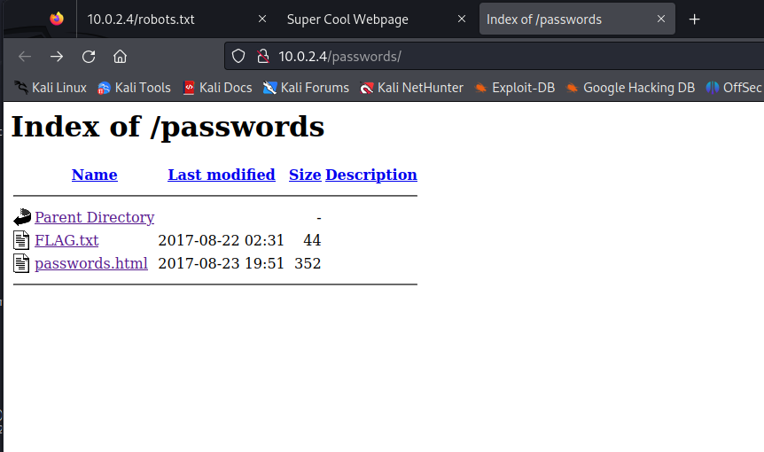

# Report Labs / Flavio POGGIOLI

## Table of contents

  - [Report Labs / Flavio POGGIOLI](#report-labs--flavio-poggioli)
  - [Table of contents](#table-of-contents)


Goal : find 8 vulnerabilities flags beginning by "FLAG{".

## Find IP of the target
  
  ```bash
  $ sudo netdiscover -r 10.0.2.0/24
  ```
  

Our target is 10.0.2.4. 

The 2 first is VBox address (network and dhcp).

## List all open ports
  
  ```bash
  $ sudo nmap -p- 10.0.2.4
  ```
    


```bash
$ sudo nmap -sV -p 21,22,80,9090,13337,22222,60000 10.0.2.4
```

That command operates a scan on the specified ports on a host or network and attempt to determine the version of the active services on those ports. 

Ports scanned : 21,22,80,9090,13337,22222,60000

  

We can find the version of some services, and for services which return any version, we can see the data of the service.

## Flag 1 - FLAG{THERE IS NO ZEUS, IN YOUR FACE!}

With the different ports scanned on previous step, we can try to connect to the services with different manners (ssh, telnet, http)...

I tried things with the port 80, which print an image of Morty, but nothing.

  

The port 9090 is a web service, and we found a flag : FLAG{THERE IS NO ZEUS, IN YOUR FACE!}.

  

## Flag 2 - FLAG:{TheyFoundMyBackDoorMorty}

With the browser, on port 13337, we can find a flag : FLAG:{TheyFoundMyBackDoorMorty}.

  

Nothing on other ports with the browser.

## Flag 3 - FLAG{Yeah d- just don't do it.}

For the port 80, which host a web server, we can dig to find a something in arborescence directory.

```bash
$ dirb http://10.0.2.4
```

  

We find files and a directory : http://10.0.2.4/passwords, this directory is listable.
In this directory, we can find a file named FLAG.txt which contains : FLAG{Yeah d- just don't do it.}

 


## Flag 4 - FLAG{Flip the pickle Morty!}

On the ports scanned, the data returned from 60000 port shows a reverse shell with his fingerprint. We can't do anything with it on browser, ssh, telnet, ftp... So we can use netcat to connect to the port and try to find something.

```bash
$ nc 10.0.2.4 60000
```
Through that, we can interact with a shell, and we can find a flag : FLAG{Flip the pickle Morty!}.

  

## Flag 5 - FLAG{Whoa this is unexpected} 

For the port 21, a more precise analysis with nmap can show us that the ftp service is vulnerable to anonymous login.

  

We can see that we can connect as anonymous on ftp, 2 files are present, FLAG.txt and pub.

  

I download FLAG.txt because we don't have any permission on ftp server to open it.

  

And we can discover a flag : FLAG{Whoa this is unexpected}.

## Flag 6 - FLAG{Get off the high road Summer!}

In password directory, there is also a file named "passwords.html". After an analysis, we can see in console that a password is hidden in the code.

 


On http://10.0.2.4/cgi-bin/tracertool.cgi found on step Flag3, there is a prompt which allows to do tracert. But, using the command on the prompt, we can interrupt the command and execute malicious command with ";".

  

So, with the password "winter", we can maybe connect with ssh to the host, so we must find username on /etc/passwd.

But when the command "; ls /etc/passwd" is executed, we can see a real cat.

  

To get around this, we can use the command "; less /etc/passwd" to find the username.

  


The connection ssh is closed on port 22, but we can try to connect on port 22222.

  

The user is Summer (opposite to the password "winter") and we can connect to it.

  

The command cat is alse printing a real cat so we can use the command "; less /home/Summer/FLAG.txt" to find a flag : FLAG{Get off the high road Summer!}.

## Flag 7 - FLAG: {131333} 

With a SSH access, we can access to Morty home directory.

  

There is a password needed to unzip journal.txt.zip.

  

The password is in Safe_Password.jpg file.

  

Meeseek is the password and we can find a flag : FLAG: {131333} 

  


### Flag 8 - FLAG{And Awwaaaaayyyyy we Go!}

  

There is an executable on personal folder of Rick, which contains a directory named "RicksSAFE".

A key is needed to open the safe, and we can find to the older flag : 131333.

But, the file is executable with the libary libmcrypt4.

  

## Flag 9 - FLAG secret 
I was also given a password hint for Rick’s password. A quick Google search found that the band name was “The Flesh Curtains”.

So, I create a python script to create the possible password.

```python
from string import ascii_uppercase
for c in ascii_uppercase:
    for x in range(0, 10):
        print str(c) + str(x) + "Flesh"
        print str(c) + str(x) + "Curtains"
```

I redirect the output to a file :
```bash
python3 scriptpython.py > password.txt
```

  


We can now try with Hydra to bruteforce the password :
```bash
hydra -s 22222 -v -V -l RickSanchez -P password.txt -t 16 10.0.2.4 ssh
```


  

And we can find finally a file named FLAG.txt in the directory /root, where RickSanchez has the permissions.

  
