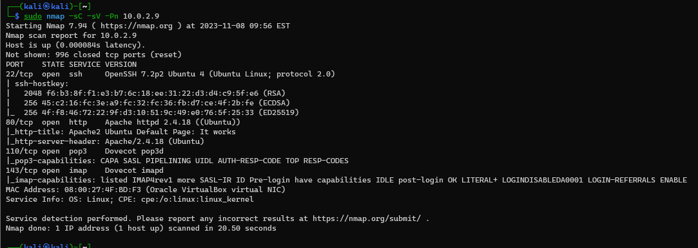

# Report Labs / Flavio POGGIOLI

## Table of contents

  - [Report Labs / Flavio POGGIOLI](#report-labs--flavio-poggioli)
  - [Table of contents](#table-of-contents)

## VM n°546

Targets : Reconnaissance, brute force, exploit, web, privilege escalation

### 1. Find IP address of the machine

```bash
$ sudo netdiscover -r 10.0.2.0/24
```
  

### 2. List all open ports

We need to determine the open ports and the services running on them using nmap with some options (uniquly ports and secondly enabling default scripts, identifying service versions, and disregarding ping host discovery.).

```bash
$ sudo nmap -p- 10.0.2.9
$ sudo nmap -sC -sV -Pn 10.0.2.9
```  
  

  


Now we can see that theses ports are open (all TCP) :
- port 22 —  OpenSSH 7.2p2 Ubuntu 4 (Ubuntu Linux; protocol 2.0)
- port 80 - Apache httpd 2.4.18 ((Ubuntu))
- port 110 - Dovecot pop3d
- port 143 - Dovecot imapd

### 3. Find vulnerabilities

#### 3.1. Port 80 - HTTP

We can see that the web server is running on port 80, so we can try to find something on it with dirb.

```bash
$ dirb http://10.0.2.9
```

  


### 4. Exploit  

