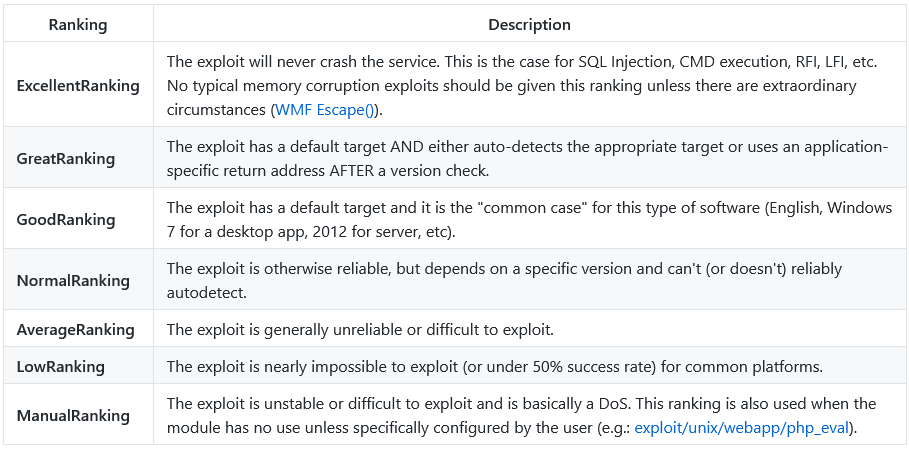

# Report TD TryHackME / Flavio POGGIOLI

## Table of contents

- [Report TD TryHackME / Flavio POGGIOLI](#report-td-tryhackme--flavio-poggioli)
  - [Table of contents](#table-of-contents)
  - [Nmap](#nmap)
  - [Burp](#burp)
  - [SQLmap](#sqlmap)
  - [Metasploit](#metasploit)


## Nmap

[TryHackMe Nmap](https://tryhackme.com/room/furthernmap)

Nmap is an open-source network scanning and discovery tool. 
It is used to scan ports, and services running on a network. 
Nmap offers scriptable automation, and various scanning techniques with special switchies, making it an essential tool for network administrators and security professionals.

It offers a wide range of options for TCP, UDP and ICMP scans. 

In TCP with some specific switches, you can scans ports to determine if they are open or closed depending on which TCP flags (SYN, ACK, RST) are sent back.

With ICMP, you can proceed to a network scanning with the switches "-sn" to determine which hosts are up or down.

NSE (Nmap Scripting Engine) is a powerful scripting language based on Lua programming language.
It allows you to write scripts and automate some scanning vulnerabilities, or even exploit them.

Main features:
- Host discovery and OS detection
- Port scanning and service identification
- Scriptable with NSE (Nmap Scripting Engine)
- Flexible output formats
- Extensive community support

For more information and documentation, visit the [Nmap website](https://nmap.org/) or in the terminal with the command:

```bash
$ nmap -h
```

## Burp

[TryHackMe Burp](https://tryhackme.com/room/burpsuitebasics)

Burp is a Java-based framework designed to serve as a comprehensive solution for conducting web application penetration testing. It serves for the security testing of web and mobile applications, including the REST API of theses applications.

Main features : 
- Proxy
- Repeater : capturing, modifying, and resending the same request multiple times.
- Intruder : allows for spraying endpoints with requests. It is commonly utilized for brute-force attacks or fuzzing endpoints.
- Comparer : allows for comparing two requests or responses.

Burp comes with a lot of options for the proxy feature (WebSockets, Response Interception...).

The feature Site Map allows you to see a tree structure of the website you are testing, and the requests you have made.

A browser based on Chromium is also provided with full support of the proxy to use it without any of the modifications we just had to do.

For more information and documentation, visit the [Burp website](https://portswigger.net/burp).

## SQLmap

[TryHackMe SQLmap](https://tryhackme.com/room/sqlmap)

SQLmap is an open source penetration testing tool that automates the process of detecting and exploiting SQL injection flaws and taking over database servers. 
It comes with a powerful detection engine to accessing the underlying file system and executing commands on the operating system via out-of-band connections.

Main features :
- Detection of SQL injection vulnerabilities
- Management of the database server
- Batch testing
- WAF bypass
- Proxy support

This tool comes with a lot of options to test our target, beginning with easy options like "--dbs" to enumerate the databases, and step by step, a lot of more difficult options to exploit the SQL injection.

For more information and documentation, visit the [SQLmap website](http://sqlmap.org/) or in the terminal with the command:

```bash
$ sqlmap -h
```

## Metasploit

[TryHackMe Metasploit](https://tryhackme.com/room/metasploitintro)

Metasploit is the most widely used exploitation framework. Metasploit is a powerful tool that can support all phases of a penetration testing test.

It comes with 2 versions, the free version and the pro version. The pro version is a paid version that offers GUI interface and facilitates the automation of tasks.

This tool allows information gathering, scanning, exploitation, exploit development, post-exploitation, and more.

Main modules :
- Auxiliary
- Encoders
- Evasion
- Exploits
- NOPs
- Payloads
- Post

The exploitation process comprises three main steps; finding the exploit, customizing the exploit, and exploiting the vulnerable service.

Metasploit provides many modules that you can use for each step of the exploitation process. 

You can search exploits with the command "search" and the name of the exploit you want to find. All exploits are ranked based on their reliability.

  

Source : [Metasploit Github - Exploit Ranking](https://github.com/rapid7/metasploit-framework/wiki/Exploit-Ranking)

For more information and documentation, visit the [Metasploit website](https://www.metasploit.com/) or use Metasploit console in the terminal with the command (after installation):

```bash
$ msfconsole
```